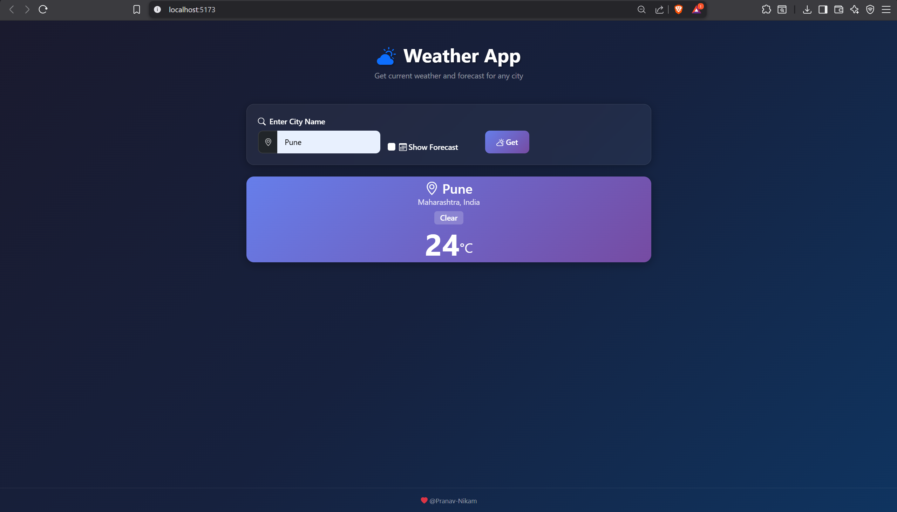
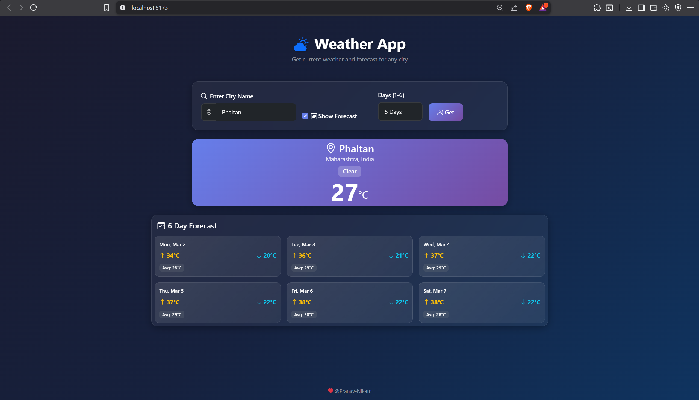

# 🌦 Weather App – Java Backend Learning Project

This project is built as part of my **Java Backend Development learning journey**.

It is a Spring Boot based REST API application that integrates with an external Weather API to fetch:

- 🌤 Current Weather Data
- 📅 Multi-Day Forecast Data

The main focus of this project is:

- Backend architecture
- REST API development
- DTO mapping
- External API integration
- Proper HTTP status handling

---

## 🎯 Learning Objectives

This project helped me understand:

- Spring Boot fundamentals
- REST Controller development
- Service layer architecture
- DTO abstraction and mapping
- Consuming external APIs using RestTemplate
- Exception handling using ResponseEntity

---

## 🛠 Tech Stack

### Backend

- Java 17+
- Spring Boot
- Maven
- RestTemplate
- WeatherAPI (External API Provider)

### Frontend

- JavaScript
- React (Vite + React)
- Fetch API

> ⚠ Note: The frontend interface (React + Vite) was generated using AI for testing and interaction purposes.  
> The main learning and implementation effort is fully on the backend.

---


## 🌍 REST API Endpoints

### 1️⃣ Get Current Weather

```
GET /weather/{city}

GET http://localhost:8080/weather/Pune
```

### 2️⃣ Get Forecast

```
GET /weather/forecast?city={city}&days={days}

GET http://localhost:8080/weather/forecast?city=Phaltan&days=3
```


## ⚙ Configuration

```
weather.api.key=YOUR_API_KEY
weather.api.url=https://api.weatherapi.com/v1/current.json?
weather.api.forecast.url=https://api.weatherapi.com/v1/forecast.json?
```


## ▶ How to Run the Project

### Clone the Repository

```bash
git clone https://github.com/pranavnikam-15/weather-app.git
cd Weather-App
```


### 🚀 Run Backend (Spring Boot)

1. Navigate to backend folder:

```bash
cd backend
```

2. Add your API key in `application.properties`

3. Run the application:

```bash
mvn spring-boot:run
```

Backend will start at:

```
http://localhost:8080
```

---

### 🌐 Run Frontend (Vite)

1. Open a new terminal

2. Navigate to frontend folder:

```bash
cd frontend
```

3. Install dependencies:

```bash
npm install
```

4. Start development server:

```bash
npm run dev
```

Frontend will run at:

```
http://localhost:5173
```


---

## 📸 Application Screenshots

### 🔹 Current Weather (Without Forecast)



---

### 🔹 Weather Forecast (With Forecast Enabled)



---


## 👨‍💻 Author
Pranav Nikam